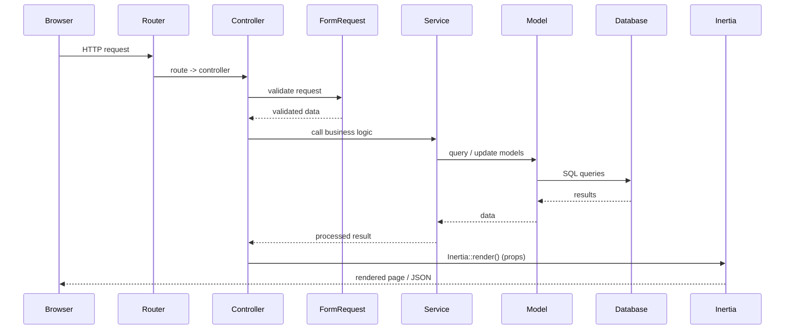
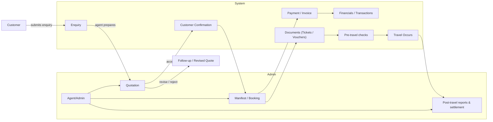

# Travel Management System

This is a Laravel + Inertia + React application for managing travel manifests, enquiries, quotations and customers.

## Key points

- **Framework**: Laravel 13 (PHP 8.2+)
- **Frontend**: Inertia.js + React, built with Vite and Tailwind CSS v4
- **Testing**: PHPUnit (use `php artisan test`)

## System requirements

- PHP 8.2 or newer
- Composer
- Node 18+ and npm (or yarn)
- A supported database (MySQL, MariaDB, Postgres)

## Quick setup

1. Clone the repo and enter the project directory.
2. Install PHP dependencies:

```bash
composer install
```

3. Install JS dependencies and build assets:

```bash
npm ci
# or
npm install
npm run dev    # for local dev (Vite)
# npm run build # for production build
```

4. Copy environment file and set values:

```bash
cp .env.example .env
php artisan key:generate
```

5. Create database and run migrations + seeders (if applicable):

```bash
php artisan migrate --seed
```

6. Create storage symlink (if not present):

```bash
php artisan storage:link
```

7. Run the app:

```bash
php artisan serve --host=127.0.0.1 --port=8000
# or use your preferred local environment (Valet, Sail, Docker, etc.)
```

## Running tests

```bash
php artisan test --filter=NameOfTest
```

## Useful commands

- `vendor/bin/pint` — run PHP formatter (project uses Pint)
- `npm run dev` — start Vite dev server
- `npm run build` — build frontend for production
- `php artisan route:list` — list application routes
- `php artisan tinker` — interact with app

## Where to look in the code

- **Routes**: [routes/web.php](routes/web.php)
- **Controllers**: app/Http/Controllers
- **Models**: app/Models
- **JS Pages (Inertia)**: [resources/js/Pages](resources/js/Pages)
- **Frontend entry / assets**: resources/js and resources/css
- **Config**: config/\*.php

## Notes for future you

- The app uses Inertia to render React pages from Laravel controllers — look in controllers that call `Inertia::render()`.
- Tailwind v4 is used; frontend styles are in `resources/css` and built via Vite.
- When changing routes/controllers, run `php artisan wayfinder:generate` if Wayfinder is used to sync routes (check `vite.config.ts`).

## System overview & flow

- **Modules**:
    - `Auth`: Fortify-based auth, policies and user management.
    - `Customers`: customer records, confirmations and member management.
    - `Enquiries`: enquiry lifecycle, remarks and status workflow.
    - `Quotations`: quote creation, status transitions and links to enquiries/customers.
    - `Manifests`: core booking/room manifest logic and dynamic room lists.
    - `Financials`: transactions, financial year rollover and reporting jobs.
    - `Jobs/Queues`: background processing for mail, exports and long tasks.
    - `Notifications/Mail`: notification channels and email templates.
    - `Services/Helpers`: shared business logic, formatters and utilities.

- **Typical request flow**:
    1.  Browser requests a URL → route defined in `routes/*.php`.
    2.  Route maps to a controller in `app/Http/Controllers`.
    3.  Controller validates via `FormRequest`, then calls a Service or Model.
    4.  Eloquent models run queries (use eager loading to avoid N+1).
    5.  Controller returns `Inertia::render()` with props (or JSON for APIs).
    6.  React/Inertia page in `resources/js/Pages` receives props and renders UI.
    7.  Forms use Inertia `<Form>` or `useForm`; responses rehydrate props.

- **Background & scheduled work**:
    - Use `app/Jobs` for queued work; run queue workers to process them.
    - Financial rollovers and scheduled tasks live in Jobs/Console commands.

- **Frontend build**:
    - Vite bundles `resources/js` and `resources/css`. Use `npm run dev` for development and `npm run build` for production.

Keep migrations, factories and seeders up to date for tests and local dev data.

If you'd like, I can also:

- add a short Development checklist, or
- include sample `.env` variables and recommended local Docker/Sail commands.

---

_README generated by assistant — concise project overview and setup._

## Development checklist

- Prereqs installed: PHP, Composer, Node, DB.
- Copy `.env.example` → `.env` and set DB credentials.
- Install PHP deps: `composer install`.
- Install JS deps and run Vite: `npm ci && npm run dev`.
- Run migrations and seeders for local data: `php artisan migrate --seed`.
- Create storage link: `php artisan storage:link`.
- Start queue worker (if processing jobs locally): `php artisan queue:work`.
- Run formatter: `vendor/bin/pint` before committing.
- Run relevant tests: `php artisan test --filter=NameOfTest`.

## Architecture / request flow (sequence)



---

_If you want a separate architecture diagram (component-level) or more checklist items (Docker/Sail, `.env` template), tell me which and I'll add them._

## Business flow (customer → booking lifecycle)



Steps explained:

- Enquiry — Customer submits travel enquiry (dates, pax, requirements). Stored in `app/Models/Enquiry`.
- Quotation — Agent prepares a quote referencing suppliers, rooms, rates and markup. Stored and linked to enquiries.
- Customer Confirmation — Customer accepts the quote. This creates a confirmation record and may create members (`CustomerConfirmation`, `CustomerConfirmationMember`).
- Manifest / Booking — The system builds a manifest (dynamic room lists) and reserves inventory where applicable.
- Payment / Invoice — Invoices and financial transactions are generated and recorded under `FinancialTransaction`.
- Documents — Tickets, vouchers and other documents are created and delivered via email (see `Mail` and `Notifications`).
- Pre-travel checks — Validation steps (documents, passport numbers, guest lists) before travel.
- Travel occurs — Manifest is used during travel; post-travel actions are performed.
- Post-travel reports & settlement — Financial rollover, reporting and job-based cleanup (see `app/Jobs` and `FinancialYearRolloverJob`).

This flow maps to controllers, services and jobs across `app/Http/Controllers`, `app/Services` and `app/Jobs`.
