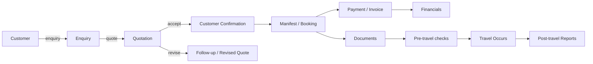

# ERP System

Enterprise Resource Planning system built on Laravel, with **HRIS (Human Resource Information System)** as its first-phase product. The backend serves two frontends from one codebase:

- **HRIS SPA** (`frontend-hris/`) — standalone React 19 app consuming JSON API via Sanctum
- **ERP Inertia UI** (`resources/js/`) — legacy Inertia + React UI for travel management modules

## Architecture

```mermaid
flowchart LR
    A["HRIS SPA<br/>(React 19, port 5173)"] -->|axios + Sanctum cookies| C["backend-codebase<br/>(Laravel 13, port 8000)"]
    B["ERP Inertia UI<br/>(port 8000)"] -->|Inertia.render()| C
    C --> D[(Database)]
```

| Frontend           | Location                    | Stack                         | Scope                                                                |
| ------------------ | --------------------------- | ----------------------------- | -------------------------------------------------------------------- |
| **HRIS SPA**       | `frontend-hris/`            | React 19 + Vite + Tailwind v4 | HR modules: auth, master data, users, settings, attendance (planned) |
| **ERP Inertia UI** | `resources/js/` (this repo) | Inertia + React               | Travel management & business modules                                 |

## HRIS Modules (Phase 1 — Live)

- **Auth** — login, forgot/reset password, two-factor challenge (Sanctum SPA)
- **Dashboard** — KPI cards, charts, recent activity
- **Notifications** — list with read/unread state, mark-read actions
- **Master Data**
    - **Country** — CRUD with DataTable
    - **Branch** — CRUD with country filter
    - **Fiscal Year** — CRUD with date ranges
    - **Users** — role-based management (Superadmin, Admin, Sales, Ops, Customer)
- **User Logs** — filterable activity log with export
- **Settings** — profile, password, appearance (theme + color), 2FA setup

## HRIS Roadmap — Attendance Module (Phase 2)

The attendance (Presensi) module is the next major phase. Full specification in [`HRIS_PRESENSI_FLOWCHARTS.md`](../HRIS_PRESENSI_FLOWCHARTS.md).

### Roles & Access

| Role               | Access                                                                                           |
| ------------------ | ------------------------------------------------------------------------------------------------ |
| **Employee**       | Check-in/out with face capture + geotagging, attendance corrections, leave requests, own history |
| **Supervisor**     | Approve/reject team corrections and leave, monitor team attendance                               |
| **HR / Personnel** | Final verification, operational data, reports                                                    |
| **Administrator**  | Org tree, employee master, user accounts, approval matrix, work schedules, leave parameters      |
| **Manager**        | Read-only summaries and reports                                                                  |

### Approval Chain

```
Employee → Supervisor → Manager → HRD (final)
```

### Key Features Planned

- Check-in / Check-out with face recognition and GPS geotagging
- Attendance correction requests with attachments
- Leave requests with balance validation
- Multi-level approval workflow
- Work schedule and shift management
- Organization hierarchy (holding → BU → department → position)
- Attendance and leave reports with export

## Legacy Modules (Travel Management)

These remain available through the Inertia UI at `:8000`. Not part of the HRIS product.

- **Sales** — quotations, orders, invoices, receipts
- **Customers** — records, confirmations, member management
- **Enquiries** — general, private, customer confirmation workflows
- **Packages** — travel package management
- **Manifests** — booking, room manifests, dynamic room lists
- **Ops Movement** — operational movement tracking



## Tech Stack

- **Framework**: Laravel 13 (PHP 8.2+)
- **Frontend (Inertia)**: Inertia.js + React + Vite + Tailwind CSS v4
- **API Layer**: Laravel Sanctum (SPA cookie auth)
- **Permissions**: spatie/laravel-permission
- **Activity Log**: spatie/laravel-activitylog
- **Testing**: PHPUnit

## Quick Setup

1. Clone and enter the project directory.
2. Install PHP dependencies:

```bash
composer install
```

3. Install JS dependencies and start Vite:

```bash
npm ci
npm run dev
```

4. Copy environment file and generate key:

```bash
cp .env.example .env
php artisan key:generate
```

5. Create database, run migrations and seeders:

```bash
php artisan migrate --seed
```

6. Create storage symlink:

```bash
php artisan storage:link
```

7. Start the server:

```bash
php artisan serve --host=127.0.0.1 --port=8000
```

## Running Tests

```bash
php artisan test --filter=NameOfTest
```

## Useful Commands

| Command                          | Purpose                         |
| -------------------------------- | ------------------------------- |
| `vendor/bin/pint`                | PHP code formatting             |
| `npm run dev`                    | Start Vite dev server           |
| `npm run build`                  | Build frontend for production   |
| `php artisan route:list`         | List all routes                 |
| `php artisan tinker`             | Interactive REPL                |
| `php artisan wayfinder:generate` | Sync Wayfinder routes (if used) |

## Project Structure

| Path                       | Purpose                          |
| -------------------------- | -------------------------------- |
| `routes/web.php`           | Inertia page routes              |
| `routes/api.php`           | HRIS SPA API routes              |
| `routes/auth.php`          | Fortify auth routes              |
| `app/Http/Controllers/`    | Controllers (Inertia + API)      |
| `app/Models/`              | Eloquent models                  |
| `resources/js/Pages/`      | Inertia React pages (legacy ERP) |
| `resources/js/components/` | Shared React components          |
| `resources/css/`           | Tailwind CSS                     |
| `config/`                  | Application configuration        |
| `database/migrations/`     | Database migrations              |
| `database/seeders/`        | Database seeders                 |

```

Steps explained:

- Enquiry — Customer submits travel enquiry (dates, pax, requirements). Stored in `app/Models/Enquiry`.
- Quotation — Agent prepares a quote referencing suppliers, rooms, rates and markup. Stored and linked to enquiries.
- Customer Confirmation — Customer accepts the quote. This creates a confirmation record and may create members (`CustomerConfirmation`, `CustomerConfirmationMember`).
- Manifest / Booking — The system builds a manifest (dynamic room lists) and reserves inventory where applicable.
- Payment / Invoice — Invoices and financial transactions are generated and recorded under `FinancialTransaction`.
- Documents — Tickets, vouchers and other documents are created and delivered via email (see `Mail` and `Notifications`).
- Pre-travel checks — Validation steps (documents, passport numbers, guest lists) before travel.
- Travel occurs — Manifest is used during travel; post-travel actions are performed.
- Post-travel reports & settlement — Financial rollover, reporting and job-based cleanup (see `app/Jobs` and `FinancialYearRolloverJob`).

This flow maps to controllers, services and jobs across `app/Http/Controllers`, `app/Services` and `app/Jobs`.
```
